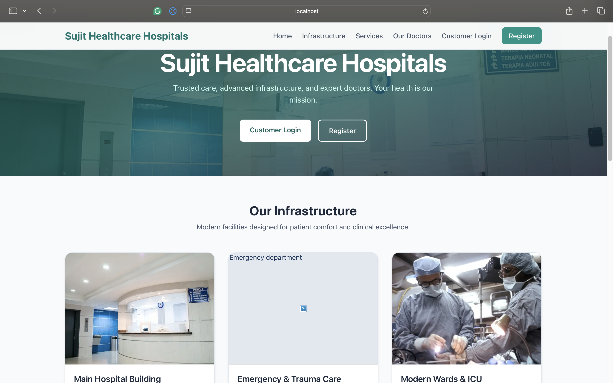
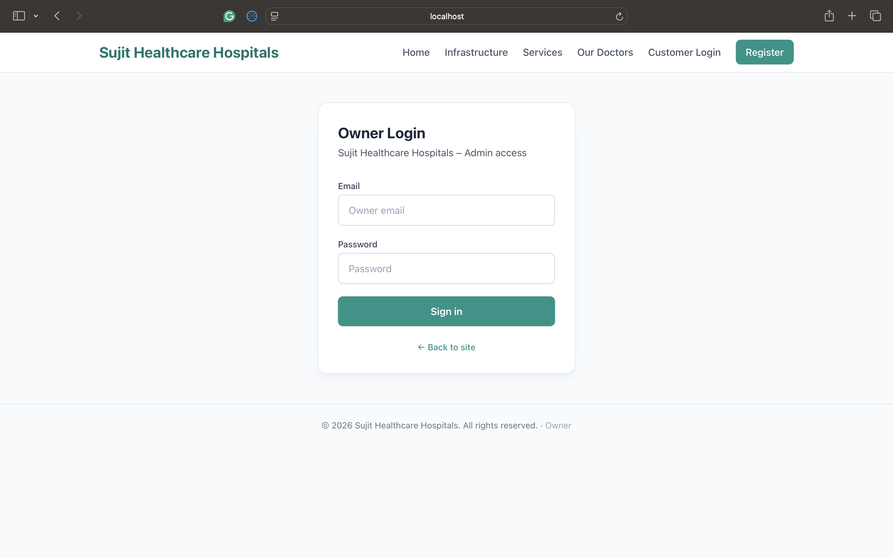

# Healthcare Web Platform

A healthcare-focused web application built to understand real-world
authentication, dashboards, and user management workflows.

## Features
- User registration and login
- Role-based admin/owner dashboard
- Active user tracking
- Modular TSX components
- Local development server

## Screenshots

### Login Page

### Customer Login Page

### Customer Verification page

### Owner Login Page

### Admin Dashboard

## Tech Stack
- React / Next.js (TypeScript)
- Node.js
- JSON configuration
- npm

## Run Locally
```bash
npm install
npm run dev
